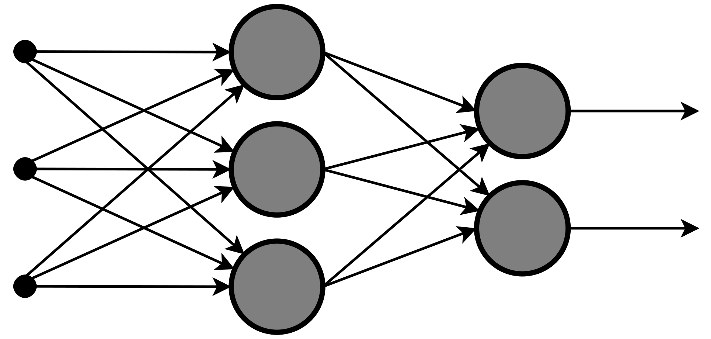

# Multilayer Perceptron

## The goal
- Implement from scratch a [multilayer perception](https://www.wikiwand.com/en/Multilayer_perceptron)
- Implement [stochastic gradient-descent](https://www.wikiwand.com/en/Stochastic_gradient_descent) and the 
[backpropagation algorithm](https://www.wikiwand.com/en/Backpropagation)
- Test effectiveness with a toy dataset

## The tools
- Python
- Numpy (Fast computation on matrices)

## The data
The project requires us to work with the [Breast Cancer Wisconsin Diagnostic](https://archive.ics.uci.edu/ml/datasets/Breast+Cancer+Wisconsin+%28Diagnostic%29) dataset.
It is a csv file of 32 columns, the column diagnosis being the label you want to learn given all the other features of an example,
it can be either the value M or B (for malignant or benign)

## The project structure
It is divided into two folders:
- `bonus/`
- `subject/`

The `subject` folder refers everything related to the Wisconsin Dataset.
The `bonus` utilises the same code, but is trained on the famous [MNIST](http://yann.lecun.com/exdb/mnist/) dataset.
In both folders, I wrote the corresponding code with the [pytorch](https://pytorch.org/) framework. 